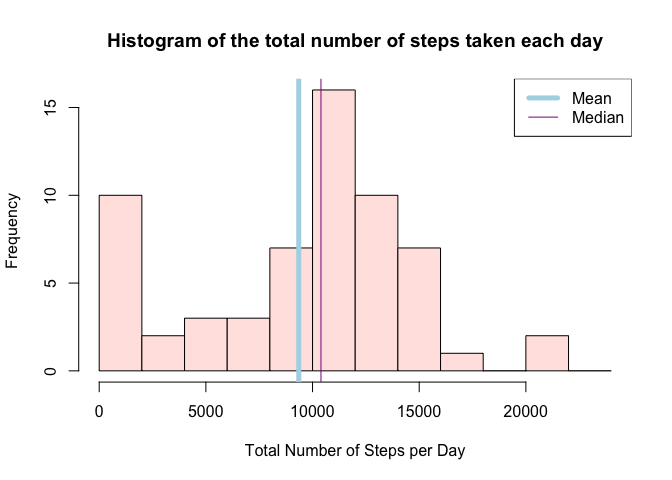
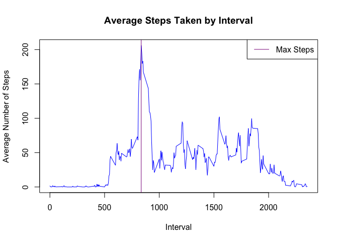
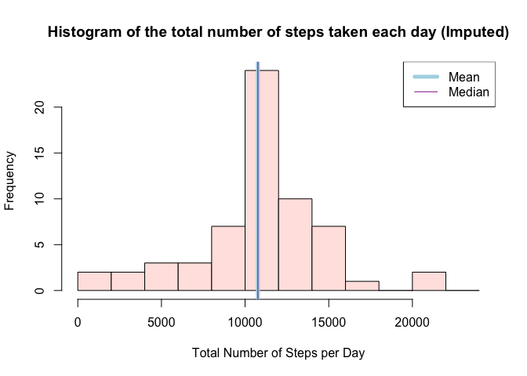
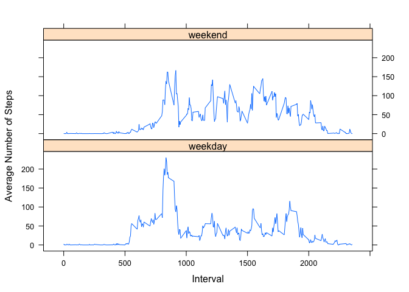

# Reproducible Research: Peer Assessment 1
Jeremy Eade  
May 28, 2016  

## Loading and preprocessing the data


```r
library(dplyr)
```

```
## 
## Attaching package: 'dplyr'
```

```
## The following objects are masked from 'package:stats':
## 
##     filter, lag
```

```
## The following objects are masked from 'package:base':
## 
##     intersect, setdiff, setequal, union
```

```r
options(scipen=999,digits=2)

df <- read.csv("activity.csv")
df <- tbl_df(df)
str(df)
```

```
## Classes 'tbl_df', 'tbl' and 'data.frame':	17568 obs. of  3 variables:
##  $ steps   : int  NA NA NA NA NA NA NA NA NA NA ...
##  $ date    : Factor w/ 61 levels "2012-10-01","2012-10-02",..: 1 1 1 1 1 1 1 1 1 1 ...
##  $ interval: int  0 5 10 15 20 25 30 35 40 45 ...
```

   
      
      
## What is mean total number of steps taken per day?

<span style="color:blue">1. Calculate the total number of steps taken per day</span>


```r
by_day <- df %>% group_by(date) %>% summarize(sum=sum(steps,na.rm=TRUE))

head(by_day)
```

```
## Source: local data frame [6 x 2]
## 
##         date   sum
##       (fctr) (int)
## 1 2012-10-01     0
## 2 2012-10-02   126
## 3 2012-10-03 11352
## 4 2012-10-04 12116
## 5 2012-10-05 13294
## 6 2012-10-06 15420
```

```r
summary(by_day$sum,na.rm=TRUE)
```

```
##    Min. 1st Qu.  Median    Mean 3rd Qu.    Max. 
##       0    6780   10400    9350   12800   21200
```


<span style="color:blue">2. Make a histogram of the total number of steps taken each day</span>


```r
steps_mean <- mean(by_day$sum,na.rm = TRUE)
steps_median <- median(by_day$sum, na.rm=TRUE)
hist(by_day$sum,breaks = seq(from=0,to=24000,by=2000),col="mistyrose1",
     main="Histogram of the total number of steps taken each day",
     xlab = "Total Number of Steps per Day")

abline(v = steps_mean,
       col = "lightblue",
       lwd = 5)

abline(v = steps_median,
         col = "magenta4",
         lwd = 1)

legend(x = "topright",
       c("Mean", "Median"),
       col = c("lightblue", "magenta4"),
       lwd = c(5, 1))
```

<!-- -->


<span style="color:blue">3. Calculate and report the mean and median of the total number of steps taken per day</span>

The mean of the total number of steps taken per day is **9354.23** and the median is **10395**.


## What is the average daily activity pattern?


<span style="color:blue">1. Make a time series plot (i.e. 𝚝𝚢𝚙𝚎 = "𝚕") of the 5-minute interval (x-axis) and the average number of steps taken, averaged across all days (y-axis)</span>


```r
by_interval<- df %>% group_by(interval) %>% summarize(avg=mean(steps,na.rm=TRUE))
max_interval <- filter(by_interval,avg==max(by_interval$avg))$interval
max_steps <- max(by_interval$avg)

str(by_interval)
```

```
## Classes 'tbl_df', 'tbl' and 'data.frame':	288 obs. of  2 variables:
##  $ interval: int  0 5 10 15 20 25 30 35 40 45 ...
##  $ avg     : num  1.717 0.3396 0.1321 0.1509 0.0755 ...
```

```r
with(by_interval,plot(interval,avg,type="l",col="blue",
                      main="Average Steps Taken by Interval",xlab="Interval",ylab="Average Number of Steps"))
abline(v = max_interval,
        col = "magenta4",
        lwd = 1)
 
legend(x = "topright",
        c("Max Steps"),
        col = c("magenta4"),
        lwd = c(1))
```

<!-- -->


<span style="color:blue">2. Which 5-minute interval, on average across all the days in the dataset, contains the maximum number of steps?</span>

The answer is interval=**835** with **206.17** steps.


   
   
## Imputing missing values


<span style="color:blue">1. Calculate and report the total number of missing values in the dataset (i.e. the total number of rows with 𝙽𝙰s)
</span>


```r
na_rows <- sum(is.na(df$steps))
total_rows <- NROW(df$steps)
```

The total number of rows with NAs is **2304** out of a total of **17568** rows.


<span style="color:blue">2. Devise a strategy for filling in all of the missing values in the dataset. The strategy does not need to be sophisticated. 
For example, you could use the mean/median for that day, or the mean for that 5-minute interval, etc.</span>

Strategy - we will use the mean for that 5-minute interval

<span style="color:blue">3. Create a new dataset that is equal to the original dataset but with the missing data filled in.</span>


```r
join <- inner_join(df,by_interval)
```

```
## Joining by: "interval"
```

```r
join <- mutate(join,steps2=ifelse(is.na(steps),avg,steps))
sum(is.na(join$steps))
```

```
## [1] 2304
```

```r
sum(is.na(join$steps2))
```

```
## [1] 0
```

```r
summary(join$steps)
```

```
##    Min. 1st Qu.  Median    Mean 3rd Qu.    Max.    NA's 
##       0       0       0      37      12     806    2304
```

```r
summary(join$steps2)
```

```
##    Min. 1st Qu.  Median    Mean 3rd Qu.    Max. 
##       0       0       0      37      27     806
```

<span style="color:blue">4. Make a histogram of the total number of steps taken each day</span>


```r
by_day2 <- join %>% group_by(date) %>% summarize(sum=sum(steps2))

summary(by_day2$sum)
```

```
##    Min. 1st Qu.  Median    Mean 3rd Qu.    Max. 
##      41    9820   10800   10800   12800   21200
```

```r
steps2_mean <- mean(by_day2$sum)
steps2_median <- median(by_day2$sum)
hist(by_day2$sum,breaks = seq(from=0,to=24000,by=2000), col="mistyrose1",
     main="Histogram of the total number of steps taken each day (Imputed)",
     xlab = "Total Number of Steps per Day")

abline(v = steps2_mean,
       col = "lightblue",
       lwd = 5)

abline(v = steps2_median,
       col = "magenta4",
       lwd = 1)

legend(x = "topright",
       c("Mean", "Median"),
       col = c("lightblue", "magenta4"),
       lwd = c(5, 1))
```

<!-- -->
   
       
<span style="color:blue">5. Calculate and report the mean and median total number of steps taken per day. </span>

The mean of the total number of steps taken per day is **10766.19** and the median is **10766.19**.

<span style="color:blue">6. Do these values differ from the estimates from the first part of the assignment? </span>


```r
diff_mean <- abs(steps_mean-steps2_mean)
diff_median <- abs(steps_median-steps2_median)
```

Yes!  There are surely differences:   

- the difference between the mean before and after imputing missing NAs is **1411.96**.   
- the difference between the median before and after imputing missing NAs is **371.19**.


<span style="color:blue">7. What is the impact of imputing missing data on the estimates of the total daily number of steps?</span>


```r
total_steps <- sum(join$steps,na.rm=TRUE)
total_steps_imputed <- sum(join$steps2)
```

The total number of steps with missing data is **570608**.   
The total number of steps with imputed data is **656737.51**.   
Thus imputing the missing data causes the total number of steps to increase.   


## Are there differences in activity patterns between weekdays and weekends?


<span style="color:blue">1. Create a new factor variable in the dataset with two levels -- "weekday" and "weekend" indicating whether a given date is a weekday or weekend day.</span>


```r
library(lubridate)
join <- mutate(join,dayOfWeek = ifelse(weekdays(ymd(date)) %in% c("Sunday","Saturday"),"weekend","weekday"))
by_dayOfWeek <- join %>% group_by(dayOfWeek,interval) %>% summarize(avg=mean(steps2))
str(by_dayOfWeek)
```

```
## Classes 'grouped_df', 'tbl_df', 'tbl' and 'data.frame':	576 obs. of  3 variables:
##  $ dayOfWeek: chr  "weekday" "weekday" "weekday" "weekday" ...
##  $ interval : int  0 5 10 15 20 25 30 35 40 45 ...
##  $ avg      : num  2.251 0.445 0.173 0.198 0.099 ...
##  - attr(*, "vars")=List of 1
##   ..$ : symbol dayOfWeek
##  - attr(*, "drop")= logi TRUE
```

```r
table(by_dayOfWeek$dayOfWeek)
```

```
## 
## weekday weekend 
##     288     288
```


<span style="color:blue">2. Make a panel plot containing a time series plot (i.e. type = "l") of the 5-minute interval (x-axis) and the average number of steps taken, averaged across all weekday days or weekend days (y-axis). </span>


```r
library(lattice)
xyplot(avg~interval|dayOfWeek,data=by_dayOfWeek,type="l",layout=c(1,2),xlab="Interval",ylab="Average Number of Steps")
```

<!-- -->
